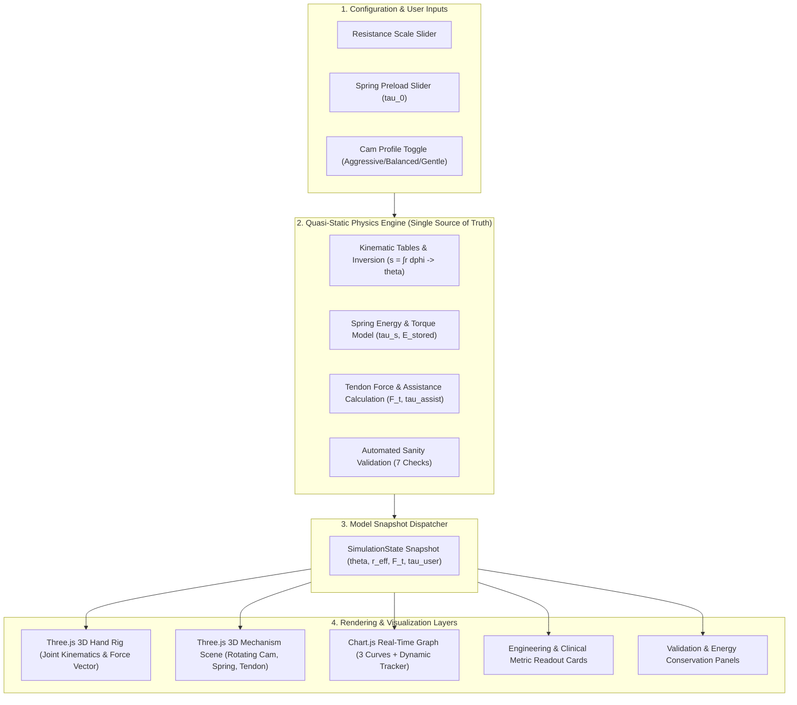

# RELEVA: Variable-Assistance Hand Orthosis for Stroke Rehabilitation

> **Physics-Based Mechanical Feasibility Demonstrator & CAD/CAM Prototype Framework**  
> *Smart India Hackathon (SIH) 2026 | Hardware Edition | Problem Statement: SIH26113*  
> **Theme:** MedTech / BioTech / HealthTech | **Partner Organization:** Autodesk

---

[](https://vitejs.dev/)
[](https://www.typescriptlang.org/)
[](https://threejs.org/)
[](https://www.chartjs.org/)
[](https://www.autodesk.com/products/fusion-360/)
[](#mathematical--physical-model)

---

## Executive Summary

**RELEVA** is a passive, tendon-driven finger-extension orthosis designed to assist stroke survivors who retain voluntary flexion (grasping) but struggle with involuntary hypertonia or extensor weakness during hand opening (release). 

The device captures biomechanical work performed during voluntary grasp, stores it in a torsion spring, and discharges that stored energy during hand opening through a **custom-profiled variable-radius cam**. By modulating the effective tendon moment arm ($r_{\text{eff}}$) as a function of cam angular displacement, the mechanism delivers maximum mechanical advantage at the onset of extension—precisely where spastic resistance is greatest—tapering assistance toward full extension.

```
                    ┌────────────────────────────────────────────────────────┐
                    │               RELEVA POWER TRANSMISSION                │
                    └────────────────────────────────────────────────────────┘
 [User Grasps] ──► [Winds Torsion Spring] ──► [Stores Passive Strain Energy (77 mJ)]
                                                          │
                                                    (Hand Opening)
                                                          ▼
 [Assisted Extension] ◄── [Finger Linkage] ◄── [Tendon Cable] ◄── [Variable-Radius Cam]
```

> [!IMPORTANT]
> **Engineering Demonstration Disclaimer:** This repository houses a **computational engineering feasibility demonstrator**, kinematics engine, and digital manufacturing pipeline. It verifies the physical coherence, transmission kinematics, and energy conservation of the proposed mechanism. It **does not claim clinical trial validation** nor does it claim to increase grip strength; its designated function is strictly the passive mechanical facilitation of finger opening.

---

## Table of Contents

1. [Problem Context & Clinical Background](#problem-context--clinical-background)
2. [The Proposed Solution: Variable-Radius Cam Transmission](#the-proposed-solution-variable-radius-cam-transmission)
3. [Mathematical & Physical Model](#mathematical--physical-model)
4. [Controlled Three-Model Comparison](#controlled-three-model-comparison)
5. [Digital Manufacturing & Autodesk Fusion Pipeline](#digital-manufacturing--autodesk-fusion-pipeline)
6. [Interactive Feasibility Simulator](#interactive-feasibility-simulator)
7. [System Architecture & Data Flow](#system-architecture--data-flow)
8. [Project Structure](#project-structure)
9. [Installation & Quick Start](#installation--quick-start)
10. [Automated Testing & Model Validation](#automated-testing--model-validation)
11. [What is Simulated vs. Production Roadmap](#what-is-simulated-vs-production-roadmap)
12. [Assumptions, Limitations & Design Safety](#assumptions-limitations--design-safety)
13. [Team & Hackathon Metadata](#team--hackathon-metadata)
14. [License](#license)

---

## Problem Context & Clinical Background

### The Clinical Deficit: Grasp Without Release
Following middle cerebral artery strokes, damage to descending corticospinal pathways frequently results in hemiparesis accompanied by flexor spasticity. A prevalent functional impairment is the **inability to open the hand**:
* Patients can often voluntarily contract the *flexor digitorum superficialis* and *profundus* to form a functional grasp.
* When attempting release, stretch hyperreflexia, shortened flexor musculotendinous units, and paretic *extensor digitorum communis* muscles prevent voluntary extension.
* Consequently, grasped objects remain trapped, converting an otherwise functional hand into an unusable extremity.

### Gaps in Existing Orthotic Interventions

| Device Architecture | Working Principle | Critical Limitation |
| :--- | :--- | :--- |
| **Static Splints** | Rigid immobilization in neutral posture | Zero dynamic assistance; causes joint stiffness and disuse atrophy |
| **Active Exoskeletons** | Battery-powered DC motors / pneumatic actuators | Bulky (>1.5 kg), high cost (>₹1,50,000), battery recharge limits, cognitive complexity |
| **Conventional Passive (e.g., SaeboFlex, SaeboGlove)** | Constant-rate extension springs or elastic bands | Constant mechanical advantage; cannot adapt to the non-linear resistance profile of spastic finger joints |

### The Engineering Opportunity
Spastic resistance during finger extension is non-linear—it exhibits an exponential or steep decay from flexion ($0^\circ$) to full extension ($70^\circ$). A conventional spring-and-pulley mechanism cannot match this curve; as the spring unwinds, its torque drops linearly, resulting in mismatched assistance. **A variable-radius cam directly solves this transmission problem.**

---

## The Proposed Solution: Variable-Radius Cam Transmission

RELEVA replaces active actuators and fixed-radius pulleys with an angle-dependent mechanical transmission:

1. **Passive Energy Harvesting:** The user's voluntary finger flexor muscles (which remain powerful) close the hand against a small torsional preload, winding a wrist-mounted torsion spring.
2. **Kinematic Translation via Cam:** The spring drives a CNC-machined cam disk. The tendon wraps across an engineered 2D polar profile where radius $r_{\text{eff}}(\phi)$ varies continuously from $10\text{ mm}$ to $20\text{ mm}$.
3. **Targeted Mechanical Advantage:**
   * **At Early Extension ($\theta \approx 0^\circ\text{ to }20^\circ$):** The cam presents its minimum radius ($r_{\text{eff}} \approx 10\text{ mm}$). Because tendon force $F_t = \eta \cdot \tau_s / r_{\text{eff}}$, minimizing $r_{\text{eff}}$ maximizes cable tension ($\sim 10\text{ N}$), overcoming peak flexor tone.
   * **At Late Extension ($\theta \approx 50^\circ\text{ to }70^\circ$):** As the fingers extend, the cam profile smoothly expands to $r_{\text{eff}} \approx 20\text{ mm}$. This reduces cable tension ($\sim 1.7\text{ N}$), preventing hyperextension and soft-tissue strain.

```
       EARLY EXTENSION (Peak Resistance)            LATE EXTENSION (Near Open)
               r_eff = 10 mm                              r_eff = 20 mm
              ┌───────────────┐                          ┌───────────────┐
              │ High F_tendon │                          │ Low F_tendon  │
              │   (~10.0 N)   │                          │   (~1.7 N)    │
              └───────┬───────┘                          └───────┬───────┘
                      ▼                                          ▼
           Overcomes Joint Hypertonia                  Prevents Hyperextension
```

---

## Mathematical & Physical Model

The simulation implements a quasi-static, 1-DOF generalized biomechanical formulation. All mathematical relationships are energy-conserving, continuous, and derived from first principles.

```
           +-------------------------------------------------------------+
           |                     KINEMATIC DERIVATION                    |
           |                                                             |
           |   phi_max = (L_t * theta_max) / r_bar = 0.977 rad = 56.0 deg |
           +-------------------------------------------------------------+
                                          │
                                          ▼
  +──────────────────────+    +──────────────────────+    +──────────────────────+
  |    Spring Torque     |    |   Tendon Force       |    |     User Effort      |
  |                      |    |                      |    |                      |
  | tau_s = tau_0 + k*phi|───►| F_t = eta*tau_s/r_eff|───►| tau_user =          |
  |                      |    | tau_assist = F_t*L_t |    | max(0, tau_res-assist|
  +──────────────────────+    +──────────────────────+    +──────────────────────+
```

### 1. Spring Energy & Torque Governing Equations
The torsional spring stores mechanical strain energy during closing and unwinds over cam travel $\phi$:
$$\tau_s(\phi_{\text{wound}}) = \tau_0 + k \cdot \phi_{\text{wound}}$$
$$E_{\text{stored}}(\phi_{\text{wound}}) = \frac{1}{2} k \phi_{\text{wound}}^2 + \tau_0 \phi_{\text{wound}}$$
* Where $k = 0.08\text{ N}\cdot\text{m/rad}$ (spring constant) and $\tau_0 = 0.04\text{ N}\cdot\text{m}$ (installed preload).
* As opening angle $\theta$ increases from $0$ to $\theta_{\max}$, remaining wound angle $\phi_{\text{wound}} = \phi_{\max} - \phi$ decreases to $0$.

### 2. Derived Kinematic Constraint (Internal Consistency)
To prevent kinematic over-determination, cam angular displacement $\phi_{\max}$ is mathematically derived rather than arbitrary:
$$\text{Tendon Travel: } s = \int_0^{\phi} r_{\text{eff}}(\phi') \, d\phi' \quad \Longleftrightarrow \quad \text{Joint Rotation: } \theta = \frac{s}{L_t}$$
$$\phi_{\max} = \frac{L_t \cdot \theta_{\max}}{\bar{r}} = \frac{0.012\text{ m} \times 1.2217\text{ rad}}{0.015\text{ m}} = 0.9774\text{ rad} \approx 56.0^\circ$$
* $\theta_{\max} = 70^\circ$ ($1.2217\text{ rad}$): Total generalized finger opening arc.
* $L_t = 12\text{ mm}$ ($0.012\text{ m}$): Tendon moment arm at the metacarpophalangeal (MCP) complex.
* $\bar{r} = 15.000\text{ mm}$: Mean effective radius across the cam stroke.

### 3. $C^1$-Continuous Cam Profiles (Zero-Integral Perturbation)
All profiles are formulated using normalized parameter $x = \phi / \phi_{\max} \in [0, 1]$:
$$\text{smoothstep}(x) = 3x^2 - 2x^3$$
$$h(x) = x^2(1 - x)^2(1 - 2x) \quad \text{where} \quad \int_0^1 h(x) \, dx = 0$$
$$r_{\text{eff}}(\phi) = r_{\min} + (r_{\max} - r_{\min}) \cdot \text{clamp}\Big(\text{smoothstep}(x) \pm 2h(x), 0, 1\Big)$$

Because $\int_0^1 h(x) \, dx = 0$, **all three cam profiles possess an identical mean radius ($\bar{r} = 15.000\text{ mm}$)**. This guarantees identical total tendon travel and identical total spring energy dissipation across all variations.

### 4. Force & Torque Equilibrium
$$F_t(\theta) = \frac{\eta \cdot \tau_s(\phi_{\text{wound}}(\theta))}{r_{\text{eff}}(\phi(\theta))}$$
$$\tau_{\text{assist}}(\theta) = F_t(\theta) \cdot L_t$$
$$\tau_{\text{user}}(\theta) = \max\Big(0, \, \tau_{\text{resistance}}(\theta) - \tau_{\text{assist}}(\theta)\Big)$$
* $\eta = 0.85$: Scalar transmission efficiency (conservative estimate accounting for tendon sheath friction).
* $\tau_{\text{resistance}}(\theta) = \text{scale} \cdot \left(0.12 \cdot e^{-2.0 \cdot \theta} + 0.02\right)\text{ N}\cdot\text{m}$: Synthetic exponential resistance model representing hypertonic flexion tone.

---

## Controlled Three-Model Comparison

To prove to evaluating judges that the mechanical advantage stems from **cam geometry** rather than simply adding a spring, the simulator runs three strictly controlled configurations simultaneously:

```
Torque (N·m)
0.14 ───┐
        │  *** Unassisted (Baseline Problem)
0.10 ───┼─ ─ ─ ─ ─ ─ ─ ─ ─ ─ ─ ─ ─ ─ ─ ─ ─ ─ ─ ─ ─ ─
        │    --- Fixed-Radius Passive (Constant r = 15mm)
0.06 ───┼─ ─ ─ ─ ─ ─ ─ ─ ─ ─ ─ ─ ─ ─ ─ ─ ─ ─ ─ ─ ─ ─
        │      ═══ RELEVA Variable Cam (Optimal Matching)
0.02 ───┴───────────────────────────────────────────►
       0° (Closed)        35° (Mid-Arc)        70° (Full Open)
```

| Parameter / Variable | 1. Unassisted | 2. Fixed-Radius Passive | 3. RELEVA (Variable Cam) |
| :--- | :--- | :--- | :--- |
| **Spring Constant ($k$)** | None | $0.08\text{ N}\cdot\text{m/rad}$ | $0.08\text{ N}\cdot\text{m/rad}$ (Identical) |
| **Spring Preload ($\tau_0$)** | None | $0.04\text{ N}\cdot\text{m}$ | $0.04\text{ N}\cdot\text{m}$ (Identical) |
| **Average Radius ($\bar{r}$)** | N/A | $15.000\text{ mm}$ (Constant) | $15.000\text{ mm}$ (Variable: $10 \to 20\text{ mm}$) |
| **Total Stored Energy** | $0.0\text{ mJ}$ | $77.31\text{ mJ}$ | $77.31\text{ mJ}$ (Identical) |
| **Delivered Tendon Work**| $0.0\text{ mJ}$ | $65.60\text{ mJ}$ | $65.60\text{ mJ}$ ($\pm 0.1\text{ mJ}$) |
| **Early User Effort ($\theta \approx 10^\circ$)** | $\sim 0.118\text{ N}\cdot\text{m}$ (High) | $\sim 0.058\text{ N}\cdot\text{m}$ (Moderate) | **$\sim 0.022\text{ N}\cdot\text{m}$ (Lowest, -81%)** |
| **Mechanical Characteristic** | Pure muscle work | Uniform downward offset | **Front-loaded, shape-matched assistance** |

---

## Digital Manufacturing & Autodesk Fusion Pipeline

Problem Statement **SIH26113** explicitly requires a human augmentation assembly designed in Autodesk Fusion with **at least one critical machinable mechanical component** and an end-to-end CNC manufacturing workflow.

```
                                AUTODESK FUSION DIGITAL MANUFACTURING
 ┌─────────────────────────┐      ┌─────────────────────────┐      ┌─────────────────────────┐
 │   1. Mathematical CAD   │ ──►  │    2. CAM Setup & Ops   │ ──►  │   3. Simulation & G-Code│
 │                         │      │                         │      │                         │
 │ • Parametric sketch     │      │ • Work Coordinate System│      │ • Collision verification│
 │ • Polar r(phi) equation │      │ • Adaptive 2D Clearing  │      │ • Post-processing       │
 │ • 8mm extrusion + bore  │      │ • 3mm 2-flute carbide   │      │ • Fanuc/GRBL NC export  │
 └─────────────────────────┘      └─────────────────────────┘      └─────────────────────────┘
```

### The Critical Machinable Component: Variable-Radius Cam
* **Component Function:** Serves as the non-circular transmission drum dictating cable excursion and mechanical advantage. Dimensional precision directly impacts the angle-force curve.
* **Why Additive Manufacturing (3D Printing) is Insufficient:** FDM/SLA thermoplastics suffer from viscoelastic creep under sustained spring tension, poor layer-shear resistance across the tendon groove, and surface friction variances that alter tendon wear.
* **Selected Subtractive Process:** 3-Axis CNC Milling from a solid **Aluminum 6061-T6** plate ($50\text{ mm} \times 50\text{ mm} \times 10\text{ mm}$).

### Autodesk Fusion Manufacturing Workflow Specification

```
   Setup 1: Stock (Al 6061-T6)
  ┌─────────────────────────┐  Tool: 3mm 2-Flute Carbide Endmill
  │      (X0, Y0, Z0)       │  Spindle: 12,000 RPM | Feed: 600 mm/min
  │   ┌─────────────────┐   │
  │   │  O  Axle Bore   │   │  Operation 1: 2D Adaptive Clearing (Roughing)
  │   │     (4.0 mm)    │   │  Operation 2: 2D Contour (Finishing pass, 0.1mm stock to leave)
  │   │    \       /    │   │  Operation 3: 2D Bore Milling (Axle through-hole)
  │   │     \_____/     │   │
  │   │  Cam Profile    │   │
  │   └─────────────────┘   │
  └─────────────────────────┘
```

1. **CAD Modeling:** The polar coordinate equation $r(\phi)$ is plotted as an equation-driven spline in Autodesk Fusion, extruded to $8.0\text{ mm}$ thickness, with a central $4.0\text{ mm}$ axle bore and torsion spring anchor notch.
2. **Setup & Workholding:** Top-center WCS origin; mechanical vise fixturing with soft jaws.
3. **Roughing Passes (2D Adaptive Clearing):**
   * *Tool:* $\varnothing 3.0\text{ mm}$ flat carbide endmill (2-flute).
   * *Cutting Parameters:* Spindle $12,000\text{ RPM}$, Feed $650\text{ mm/min}$, Stepdown $2.0\text{ mm}$, Stepover $1.2\text{ mm}$.
4. **Finishing Contour (2D Contour):**
   * Full-depth finishing pass at $0.05\text{ mm}$ stepover with tangential lead-in/lead-out to achieve surface roughness $R_a \le 0.8\text{ }\mu\text{m}$, minimizing tendon abrasion.
5. **Machining Simulation & Verification:** Toolpath animation in Fusion's Manufacture workspace confirms zero tool-holder collisions, zero shank gouging, and verifies cut times under 4.5 minutes per component.

---

## Interactive Feasibility Simulator

To make the physics immediately understandable to evaluators, the repository contains a standalone, real-time client simulator running at 60 FPS.

```
┌────────────────────────────────────────────────────────────────────────────────────────┐
│ RELEVA — Variable-Assistance Hand Orthosis               [▶ JUDGE DEMO (54s)] [⚙ Reset] │
├───────────────────────────────────────────┬────────────────────────────────────────────┤
│               UNASSISTED                  │                   RELEVA                   │
│         [3D Procedural Hand]              │       [3D Procedural Hand + Orthosis]      │
│                                           │   CRITICAL CNC COMPONENT: Variable Cam     │
│ Opening Angle (θ):               16.9°    │ Opening Angle (θ):               16.9°     │
│ Opening Resistance (synthetic):  0.087 N·m│ Effective Moment Arm (r_eff):    12.8 mm   │
│                                           │ Tendon Force (F_tendon):         6.15 N    │
│                                           │ Assistance Torque (τ_assist):    0.074 N·m │
│ User Effort Required:            0.087 N·m│ User Effort Required:            0.013 N·m │
├───────────────────────────────────────────┴────────────────────────────────────────────┤
│ LIVE COMPARISON GRAPH: Required User Torque (N·m) vs Opening Angle (°)                 │
│ 0.14 ──                                                                                │
│        ─── Unassisted (Grey)                                                           │
│ 0.08 ── - - Fixed-Radius Baseline (Amber)                                              │
│        ═══ RELEVA Variable Cam (Teal)  ● [Live Position Tracker]                       │
│ 0.00 ─────────────────────────────────────────────────────────────────────────►        │
│      0° (Closed)                          35°                             70° (Open)   │
├───────────────────────┬────────────────────────────────┬───────────────────────────────┤
│ SIMULATION CONTROLS   │ MODEL VALIDATION (Automated)   │ ENERGY ACCOUNTING (Closed)    │
│ Resistance: [ 1.0× ]  │ [✓] Radius Strictly Positive   │ ENERGY ACCOUNTED FOR ✓        │
│ Preload:   [ 40 mN·m] │ [✓] Continuous Smoothness (C¹) │ W_tendon = 65.60 mJ           │
│ Cam Profile:          │ [✓] Non-Negative User Effort   │ E_stored = 77.31 mJ           │
│ [Aggressive][Balanced]│ [✓] Boundary & Angle Limits    │ Efficiency Loss: ~15.1% (η)   │
└───────────────────────┴────────────────────────────────┴───────────────────────────────┘
```

### Key UI Capabilities
* **Side-by-Side Synchronized 3D Hand Rigs:** Rendered in Three.js; simultaneously tracks an unassisted hand vs. a RELEVA-assisted hand across the identical harmonic motion profile.
* **Proportional 3D Force Vectors:** The assistance arrow on the RELEVA hand is driven directly by instantaneous physical tendon tension ($F_t$). It visibly peaks at release initiation ($\sim 10\text{ N}$) and smoothly shortens as the fingers extend.
* **Mechanism Reveal Scene:** Visualizes the complete kinematic chain: coiled torsion spring, rotating variable cam with real-time contact-radius indicator bead, taut tendon line, and finger bracket.
* **Automated 54-Second Judge Demo:** A scripted presentation sequence executing in 9 deterministic steps:
  1. *Unassisted Baseline* (5s): Demonstrates stroke deficit without assistance.
  2. *Torque Graph Isolation* (5s): Plots the unassisted exponential load curve.
  3. *RELEVA Introduction* (5s): Fades in the orthosis frame and transmission.
  4. *Assisted Motion* (8s): Synchronized dual-hand demonstration of reduced effort.
  5. *Mechanism Inspection* (7s): Highlights the CNC cam and spring assembly.
  6. *Moment Arm Modulation* (6s): Focuses on the dynamic radius change ($r_{\text{eff}}$).
  7. *Three-Model Comparison* (8s): Renders all three curves to isolate cam contribution.
  8. *Profile Parameter Tuning* (5s): Switches cam profiles to show programmatically shaped assistance.
  9. *Feasibility Summary* (5s): Summarizes validation metrics and prototype readiness.

---

## System Architecture & Data Flow

The software is structured around a strict single-source-of-truth pipeline where UI, 3D scenes, and graphs never compute physics independently.



---

## Project Structure

```
releva-sim/
├── src/
│   ├── config.ts              # Global design constants, bounds & derived kinematics
│   ├── main.ts                # Application orchestrator, loop & presentation director
│   ├── style.css              # Clinical engineering responsive design & focus modes
│   ├── physics/
│   │   ├── cam.ts             # C¹-continuous cam profile mathematics & polar generator
│   │   ├── spring.ts          # Torsional spring constitutive laws & strain energy
│   │   ├── model.ts           # Quasi-static mechanics, kinematic tables & integrator
│   │   └── validation.ts      # 7-point model validation suite (checks continuity, energy)
│   ├── scene/
│   │   ├── hand.ts            # Procedural 3D hand anatomical rig with MCP/PIP/DIP joints
│   │   ├── camMesh.ts         # Extruded 2D polar cam geometry & live contact bead
│   │   └── mechanism.ts       # Mechanism reveal stage (spring coil, cam, tendon route)
│   └── ui/
│       ├── controls.ts        # Sliders, cam selectors, and parameter bounds
│       ├── graph.ts           # Chart.js live three-model comparative plotting
│       ├── judgeDemo.ts       # Scripted, deterministic 9-step evaluator walkthrough
│       └── panels.ts          # Dual-label readouts, energy badge & assumptions drawer
├── acceptance_tests.mjs       # Headless Node.js test suite for physics verification
├── force_gradient_analysis.mjs# Diagnostic gradient script for smoothness verification
├── index.html                 # Web application entry point
├── package.json               # Dependencies (Three.js, Chart.js, Vite, TypeScript)
├── tsconfig.json              # Strict TypeScript compiler options
└── dist/                      # Compiled production distribution bundle
```

---

## Installation & Quick Start

### Prerequisites
* **Node.js:** v18.0.0 or higher
* **npm:** v9.0.0 or higher
* Modern web browser with WebGL support (Chrome, Firefox, Edge, Safari)

### Setup Instructions

```powershell
# 1. Clone the repository
git clone https://github.com/[Add GitHub URL]/releva-sim.git
cd releva-sim

# 2. Install production and development dependencies
npm install

# 3. Execute headless physics acceptance tests
node acceptance_tests.mjs

# 4. Launch local development server
npm run dev
```

The simulator will launch locally at:
**`http://localhost:5173/`** *(or `http://localhost:5174/` if port 5173 is occupied)*.

### Building for Production
```powershell
# Typecheck and compile optimized bundle
npm run build
```
Build output is emitted to `dist/`, fully statically hostable on GitHub Pages, Vercel, or Netlify.

---

## Automated Testing & Model Validation

The physics core is covered by headless unit tests (`acceptance_tests.mjs`) ensuring mathematical defensibility prior to UI rendering:

```powershell
node acceptance_tests.mjs
```

### Expected Output
```text
═══════════════════════════════════════════════════════
  RELEVA — Physics Acceptance Tests
  phi_max = 56.00° (derived from kinematics)
═══════════════════════════════════════════════════════
  ✓ [A] Resistance↑ → tau_user↑ (lo=0.0456 hi=0.0977 N·m)
  ✓ [B] Preload↑ → tau_assist↑ (lo=0.0533 hi=0.0804 N·m)
  ✓ [C] Larger r_eff → lower F_t (early r=10.6mm F=8.57N, late r=19.8mm F=1.97N)
  ✓ [D] RELEVA tau_assist varies with theta (range: 0.0236 to 0.1028 N·m)
  ✓ [E] Fixed-radius r_eff is constant (variation = 0.00e+0 m)
  ✓ [F] Unassisted tau_assist = 0 everywhere
  ✓ [G] Physics model is deterministic (identical inputs produce identical states)
  ✓ [H] Cam profile switch modulates assistance curve (Aggressive ≠ Balanced ≠ Gentle)
  ✓ [I] Energy accounting valid across all profiles (W_tendon = 65.60mJ ≤ E_stored = 77.31mJ)
  ✓ [J] All models use identical theta trajectory (theta_max = 70.00°)
  ✓ [K] phi_max derived from kinematics (phi_max = 56.00°)
  ✓ [EXTRA] All profiles share identical average radius (r_bar = 15.000 mm)
═══════════════════════════════════════════════════════
  Results: 12 passed, 0 failed
═══════════════════════════════════════════════════════
```

### In-Browser Real-Time Validation Suite
Every frame of the simulator runs 7 runtime sanity checks displayed in the validation panel:
1. **Positive Radius:** $r_{\text{eff}}(\phi) > 0$ across all $\phi \in [0, \phi_{\max}]$.
2. **Radial Envelope:** $r_{\text{eff}} \in [10.0\text{ mm}, 20.0\text{ mm}]$ (guarantees compact wrist clearance).
3. **Numerical Finiteness:** No `NaN`, `null`, or `Infinity` encountered in state evaluations.
4. **Continuity & Smoothness ($C^1$):** Single-step force delta $|\Delta F_t| < 0.5\text{ N}$ (actual max is $0.088\text{ N}$ per $0.35^\circ$ step).
5. **Non-Negative User Effort:** $\tau_{\text{user}} \ge 0\text{ N}\cdot\text{m}$ (device cannot exert involuntary opening work beyond equilibrium).
6. **Thermodynamic Inequality:** $W_{\text{tendon}} \le E_{\text{stored}}$ (strict energy conservation confirmation).
7. **Angular Limits:** $\theta \le 70.0^\circ$ and $\phi \le 56.0^\circ$.

---

## What is Simulated vs. Production Roadmap

To maintain strict scientific honesty during SIH judging, boundaries between computational models and physical production plans are explicitly delineated:

```
┌───────────────────────────────────────┬───────────────────────────────────────┐
│     CURRENT SIMULATION PROTOTYPE      │      PHYSICAL PRODUCTION ROADMAP      │
├───────────────────────────────────────┼───────────────────────────────────────┤
│ • 1-DOF generalized finger complex    │ • Independent 4-finger tendon routing │
│ • Synthetic exponential resistance    │ • Dynamometer-measured patient curves │
│ • Procedural box/cylinder 3D rig      │ • Form-fitting 3D-scanned gauntlet    │
│ • Constant scalar friction (η = 0.85) │ • Teflon-lined Bowden cable sheaths   │
│ • Numerical kinematic inversion       │ • CNC-milled 6061-T6 aluminum cam     │
│ • Ideal taut-cable assumption         │ • Manual thumbwheel cable tensioner   │
└───────────────────────────────────────┴───────────────────────────────────────┘
```

### Physical Prototype Development Milestones
1. **Milestone 1 (Subtractive Machining):** Mill the variable-radius cam on a 3-axis CNC router/mill from $10\text{ mm}$ 6061-T6 plate using toolpaths exported from Autodesk Fusion.
2. **Milestone 2 (Benchtop Dynamometry):** Mount the milled cam and spring on a test rig; drive the tendon using a linear actuator equipped with a load cell to empirically map $F_t(\theta)$ and measure actual friction losses.
3. **Milestone 3 (Chassis Rapid Prototyping):** 3D print the dorsal forearm cuff and finger thimbles in Tough PLA/PETG with integrated low-friction cable guides.
4. **Milestone 4 (Functional Fitting & Range Validation):** Verify on healthy volunteers that voluntary grip loads the spring without excessive resistance and that release reliably drives fingers to neutral extension.

---

## Assumptions, Limitations & Design Safety

### Biomechanical Modeling Assumptions
* **Quasi-Static Mechanics:** Inertial, damping, and viscoelastic tissue components are neglected due to low angular velocities typical of post-stroke grasp-and-release exercises ($\le 30^\circ/\text{s}$).
* **Single Generalized Degree of Freedom:** Finger joints (MCP 40%, PIP 35%, DIP 25%) are synchronized into a unified angular displacement vector $\theta$.
* **Synthetic Resistance Curve:** Represents an idealized clinical hypertonia profile. Actual patient profiles vary widely in magnitude and threshold angle.

### Embedded Safety Concepts (Fail-Safe Architecture)
1. **Mechanical Travel Stop:** Cam axle incorporates a hard pin-in-slot limiter physically arresting cam rotation at $\phi = 56.0^\circ$, mechanically eliminating risk of finger hyperextension beyond $70^\circ$.
2. **Passive Force Saturation:** Peak spring energy is strictly limited to $77.31\text{ mJ}$. Even in event of total flexor relaxation, tendon pull cannot exceed $12\text{ N}$—well below tendon rupture and joint injury thresholds ($>50\text{ N}$).
3. **Instantaneous User Override:** Because the mechanism is passive and single-acting, voluntary flexor activation immediately overpowers the assistance spring with zero mechanical jamming.

---

## Team & Hackathon Metadata

* **Hackathon:** Smart India Hackathon (SIH) 2026
* **Track:** Hardware Edition
* **Problem Statement:** SIH26113 — Human Augmentation Design & Manufacturing
* **Sponsoring Partner:** Autodesk
* **Team Name:** `[Add Team Name]`
* **Institution:** `[Add College / University Name]`

### Team Contributors
* **`[Member 1 Name]`** — Lead Mechanical Design / CAD & Fusion 360 CAM Pipeline
* **`[Member 2 Name]`** — Biomechanics Modeling & Kinematic Equations
* **`[Member 3 Name]`** — Software Architecture, Three.js & Physics Simulation
* **`[Member 4 Name]`** — UI/UX Design, Data Visualization & Front-End
* **`[Member 5 Name]`** — Ergonomics, Clinical Literature & Prior Art Research
* **`[Member 6 Name]`** — Manufacturing Documentation, Toolpathing & Physical Prototyping

---

## License

This project is licensed under the **MIT License** — see the [LICENSE](LICENSE) file for details.

```text
Copyright (c) 2026 Team RELEVA

Permission is hereby granted, free of charge, to any person obtaining a copy
of this software and associated documentation files (the "Software"), to deal
in the Software without restriction, including without limitation the rights
to use, copy, modify, merge, publish, distribute, sublicense, and/or sell
copies of the Software, and to permit persons to whom the Software is
furnished to do so, subject to the following conditions:

The above copyright notice and this permission notice shall be included in all
copies or substantial portions of the Software.
```
